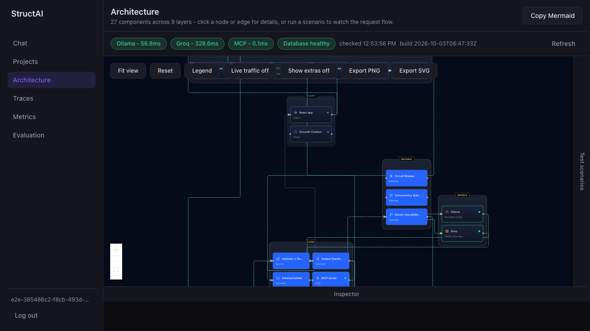
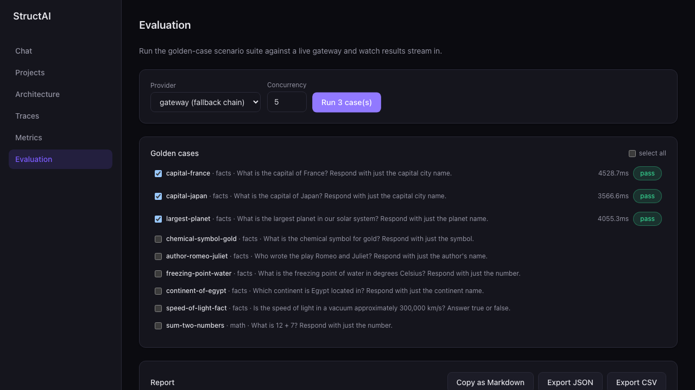
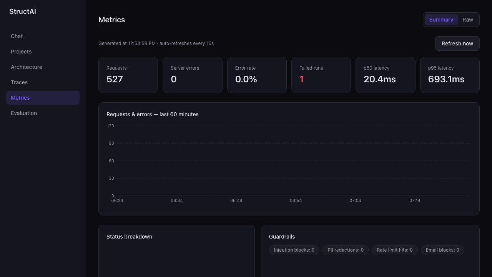

# StructAI

> Ask anything. Get answers in your structure.

StructAI is a containerized FastAPI service (plus a React web app) that lets a logged-in user ask any question and define the exact JSON fields they want back. The service guarantees the answer validates against that schema, using an open model — run locally via **Ollama** or via the **Groq** free tier — behind a JWT-secured, Pydantic-validated gateway.

Core idea: *the model is probabilistic, everything around it must be deterministic.*

## Features

- **Schema-guaranteed answers** — define fields (`string`, `number`, `boolean`, lists, nested objects) and get back JSON that validates against them every time, with automatic retry-on-invalid-output against the model.
- **Dual-provider gateway** — Ollama (local, free) and Groq (free-tier API) behind a shared retry/circuit-breaker interface, with automatic fallback between them.
- **Five-layer guardrail chain** in front of every structured-answer call: prompt-injection screening, PII redaction, per-user rate limiting, daily quota, and an email-content guardrail.
- **Projects, chats, and files** — persistent projects containing chats containing messages, plus generic file upload/storage, all scoped per authenticated user.
- **Live observability** — structured logging, an in-process tracer, and Prometheus-style metrics (request counts, latency, guardrail blocks, and real failed-run accounting), surfaced in a live Metrics tab.
- **Golden-case evaluation harness** — 25 hand-written cases runnable from the CLI or from a live-streaming in-app Evaluation tab, with a leaderboard and provider head-to-head comparison.
- **Interactive architecture explorer** — the Architecture tab renders the real system graph (nodes/edges generated from live backend data) and can replay scripted scenarios (happy path, prompt-injection attack, PII redaction, rate limiting) against the real guardrail/gateway code.
- **MCP server** — exposes schema validation, structured answering, and file tools to MCP-compatible clients like Claude Desktop/Code.

## Screenshots

| Architecture explorer | Live Evaluation run | Metrics dashboard |
|---|---|---|
|  |  |  |

More in [docs/assets/](docs/assets/).

## Architecture

```
┌─────────────┐      ┌──────────────────────────────────────────────┐
│  React SPA  │─────▶│                FastAPI gateway                │
│ (Vite + TS) │◀─────│                                                │
└─────────────┘      │  routes/  → services/  → guardrails/ → gateway/│
                      │   (parse)   (business      (5 layers)  (Ollama │
                      │              logic)                     /Groq)│
                      │                 │                              │
                      │                 ▼                              │
                      │     SQLAlchemy + SQLite (users, projects,       │
                      │     chats, messages, files)                    │
                      └──────────────────────────────────────────────┘
```

- **`app/routes/`** parse and validate requests only — no business logic lives here.
- **`app/services/`** hold the actual logic (auth, structured answering, projects/chats/files, metrics, architecture graph, evaluation).
- **`app/guardrails/`** are small, independently testable checks (injection, PII, rate limit, quota, email) chained in front of the structured-answer path.
- **`app/gateway/`** wraps each model provider behind a shared retry + circuit-breaker interface, so the rest of the app never talks to Ollama/Groq directly.
- Every request/response body is a Pydantic v2 model with `extra="forbid"` — no untyped dicts cross a route boundary.

See [docs/ARCHITECTURE.md](docs/ARCHITECTURE.md) for the full, auto-generated node/edge/scenario breakdown.

## Stack

- **Backend:** FastAPI (async), Pydantic v2, SQLAlchemy 2.x + SQLite, PyJWT, bcrypt, Prometheus client, an in-process tracer.
- **Frontend:** React 19 + Vite + TypeScript, Tailwind, `@xyflow/react` (Architecture tab canvas), framer-motion.
- **Models:** Ollama (local) and Groq (free-tier API), with fallback between them.
- **Infra:** Multi-stage Docker build, `docker-compose`, GitHub Actions CI, an MCP server for agent/tool clients.

## Project structure

```
app/            FastAPI backend: models, schemas, core (auth/config/errors/logging/metrics/tracing),
                guardrails, gateway (model providers), services, routes, mcp/
alembic/        DB migrations
eval/           Golden-case harness (cases, runner, reports)
frontend/       React + Vite + TypeScript SPA
scripts/        CLI utilities (eval runner, load test, MCP token issuance, etc.)
tests/          unit/, integration/, harness/ (FakeProvider et al.)
docs/           Architecture, API, guardrails, observability, evaluation, usage, MCP docs
```

## Getting started

### Backend

```bash
cp .env.example .env            # set JWT_SECRET (>=32 random bytes), GROQ_API_KEY, etc.
python3 -m venv .venv
.venv/bin/pip install -e ".[dev]"
.venv/bin/alembic upgrade head
.venv/bin/uvicorn app.main:app --reload
```

```bash
curl http://localhost:8000/health

curl -X POST http://localhost:8000/auth/register -H "Content-Type: application/json" \
  -d '{"email":"you@example.com","password":"password123"}'

# log in, then validate a custom schema (replace $TOKEN with the access_token from /auth/login):
curl -X POST http://localhost:8000/schemas/validate -H "Content-Type: application/json" \
  -H "Authorization: Bearer $TOKEN" \
  -d '{"fields":[{"name":"title","type":"string"},{"name":"tags","type":"string_list","required":false}]}'

# ask a question with that schema and get a guaranteed-valid structured answer:
curl -X POST http://localhost:8000/structured/answer -H "Content-Type: application/json" \
  -H "Authorization: Bearer $TOKEN" \
  -d '{"prompt":"Capital of France and a one-word vibe","schema_def":{"fields":[{"name":"capital","type":"string"},{"name":"vibe","type":"string"}]}}'
```

More endpoints (projects/chats/messages, file upload, usage, search, the architecture graph, the eval harness, the MCP server) are documented with full examples in [docs/API.md](docs/API.md) and the Quick start section of each doc below.

Run the test suite with `.venv/bin/pytest` (or `make test`); lint with `make lint` (`ruff` + `mypy`).

### Frontend

The backend must be running on `http://localhost:8000` (the default from `uvicorn app.main:app --reload`) for the Vite dev proxy to work.

```bash
cd frontend
npm install                  # or: make frontend-install
npm run dev                  # or: make frontend-dev — serves at http://localhost:5173
npm run build                 # or: make frontend-build — tsc -b && vite build
npx vitest run                # or: make frontend-test
npm run lint                   # or: make frontend-lint — oxlint
```

For a non-proxied deployment (frontend and backend on different origins), set `VITE_API_BASE_URL` in `frontend/.env` to the backend's full URL.

### Docker

```bash
make up      # docker-compose up --build -d
make down
```

### Everything at once

`make dev` runs the backend (`uvicorn --reload`) and the frontend dev server together.

## Testing & evaluation

```bash
.venv/bin/pytest                                    # or: make test — 325 tests, 94.84% coverage (gate 85%)
.venv/bin/python3 scripts/run_eval.py                # or: make eval — 25 golden cases against the default gateway
.venv/bin/python3 scripts/run_eval.py --compare      # Ollama vs. Groq head-to-head
.venv/bin/python3 scripts/load_test.py --base-url http://localhost:8000 --requests 15 --concurrency 5
```

Frontend: `npx vitest run` (115 tests) and a Playwright E2E suite in `frontend/e2e/` (run manually against a live `make dev`).

## Docs

| Doc | What's in it |
|---|---|
| [docs/ARCHITECTURE.md](docs/ARCHITECTURE.md) | System diagram + full node/edge/scenario tables, generated straight from the live `/arch/graph` data |
| [docs/API.md](docs/API.md) | Every route, request/response shape, and error code |
| [docs/GUARDRAILS.md](docs/GUARDRAILS.md) | The five guardrail layers — what each does and doesn't protect against |
| [docs/OBSERVABILITY.md](docs/OBSERVABILITY.md) | Tracing, Prometheus metrics, structured logging, health/readiness |
| [docs/EVALUATION.md](docs/EVALUATION.md) | The golden-case harness, the in-app Evaluation tab, and current real pass-rate numbers |
| [docs/USAGE_GUIDE.md](docs/USAGE_GUIDE.md) | A walkthrough of the web app for end users |
| [docs/MCP_SERVER.md](docs/MCP_SERVER.md) | MCP credential setup and the full tool/resource list for Claude Desktop/Code |

## Known limitations

See each doc's own "Known limitations" section for specifics ([GUARDRAILS.md](docs/GUARDRAILS.md), [OBSERVABILITY.md](docs/OBSERVABILITY.md), [EVALUATION.md](docs/EVALUATION.md), [USAGE_GUIDE.md](docs/USAGE_GUIDE.md)). One cross-cutting gap: `.github/workflows/ci.yml` only runs backend `ruff check` + `pytest` on push/PR — frontend lint/typecheck/build, `mypy`, the Playwright E2E suite, and the Docker image build are all verified locally, not yet gated in CI.

## License

MIT — see [LICENSE](LICENSE).
